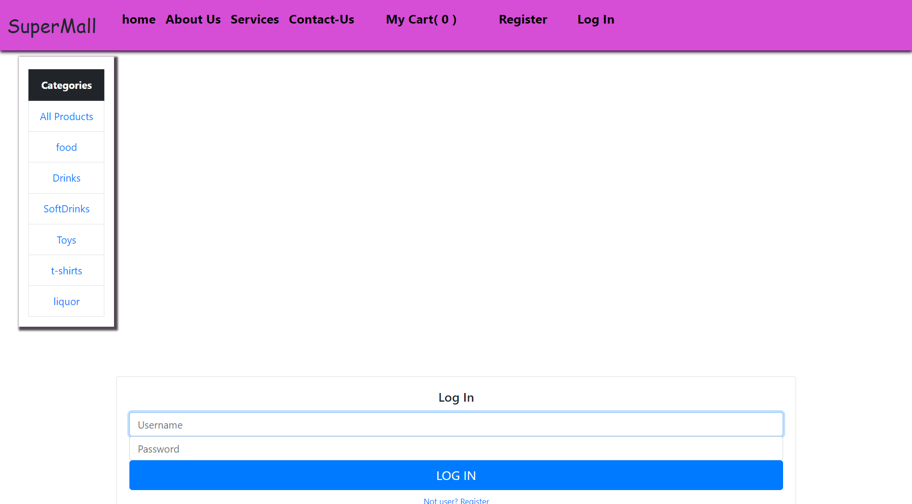

# **Supermall - E-Commerce Website**

**Supermall** is a fully-featured e-commerce web application built with a focus on user experience, scalability, and performance. This platform allows users to browse, search, and purchase a wide range of products with ease. The application is designed to handle multiple users, secure transactions, and seamless integration with payment gateways.

## **Key Features:**

- **User-Friendly Interface:** The platform is designed with an intuitive and responsive interface, making it accessible on both desktop and mobile devices.
- **Product Search and Filtering:** Users can search for products using various filters like category, price range, and ratings, ensuring a tailored shopping experience.
- **Secure User Authentication:** The application supports secure user authentication, allowing customers to create accounts, log in, and manage their profiles safely.
- **Shopping Cart and Checkout:** A robust shopping cart system with a streamlined checkout process that supports multiple payment options, ensuring a smooth purchase experience.
- **Order Management:** Users can track their orders, view order history, and manage returns, enhancing the overall customer experience.
- **Admin Panel:** A comprehensive admin panel to manage products, categories, orders, users, and site content, providing full control over the e-commerce operations.
- **Payment Gateway Integration:** Integration with popular payment gateways to ensure secure and efficient transactions.

## **Tech Stack:**

- **Front-end:** HTML, CSS, JavaScript, React.js
- **Back-end:** Node.js, Express.js
- **Database:** MongoDB (NoSQL)
- **Authentication:** JSON Web Tokens (JWT)
- **Payment Processing:** Integrated with Stripe/PayPal
- **Deployment:** Deployed on [Platform] using CI/CD pipeline for seamless updates.

## **Future Enhancements:**

- **Recommendation System:** Implementing a recommendation system to personalize the shopping experience based on user preferences and browsing history.
- **Multi-Language Support:** Expanding the platform to support multiple languages to cater to a global audience.
- **Advanced Analytics:** Adding an analytics dashboard for admins to track sales, user behavior, and inventory management in real-time.
